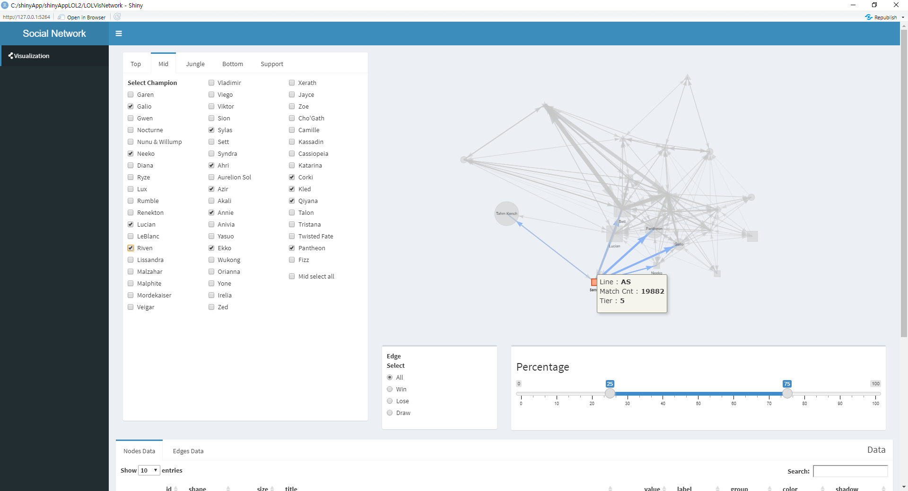

# 리그오브 레전드 네트워크 시각화

리그오브 레전드 챔피언들의 승률 상성을 볼 수 있는 네트워크 시각화 앱 입니다.

# APP 확인하기

네트워크 시각화 APP 입니다.




[기능 확인하기](./option.md)


# 사용한 라이브러리

```r
library(shiny)
library(shinydashboard)
library(tidyverse)
library(DT)
library(visNetwork)
library(rsconnect)
```

# 소스 구조도

```r
└─shinyAppLOL2
    │  app.R
    │
    ├─data
    │      EDGE_DATA.csv
    │      NODES_DATA.csv
    │
    └─LOLVisNetwork
        .RData
        server.R
        ui.R
```

# App 실행 방법

```r
# app.R

setwd("현재 APP의 경로")

# 사용할 Data를 받습니다.
load( "./LOLVisNetwork/.RData" )

runApp("LOLVisNetwork") # 실행
```

# 참고 문서

[Network Visualization by igraph](https://rstudio-pubs-static.s3.amazonaws.com/337696_c6b008e0766e46bebf1401bea67f7b10.html)

[https://kateto.net/netscix2016.html](https://kateto.net/netscix2016.html)

[Introduction to Network Analysis with R](https://www.jessesadler.com/post/network-analysis-with-r/)

[R igraph manual pages](https://igraph.org/r/doc/)

[Edges](https://datastorm-open.github.io/visNetwork/edges.html)

[Introduction to visNetwork](https://cran.r-project.org/web/packages/visNetwork/vignettes/Introduction-to-visNetwork.html)

[visEdges: Network visualization edges options in visNetwork: Network Visualization using 'vis.js' Library](https://rdrr.io/cran/visNetwork/man/visEdges.html)
